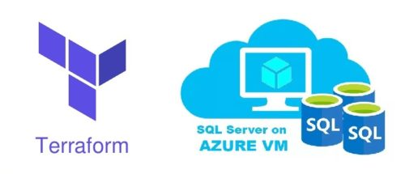

# Terraform with MS SQL Server

This project demonstrates deploying MS SQL Server using Terraform.

## Architecture



```
.
├── main.tf
├── variables.tf
├── outputs.tf
├── providers.tf
└── modules
    ├── resource_group
    │   └── main.tf
    └── sql
        └── main.tf

```
## Execution

## After Pulling

```


terraform fmt
terraform init
terraform validate
terraform plan
terraform apply -auto-approve

```